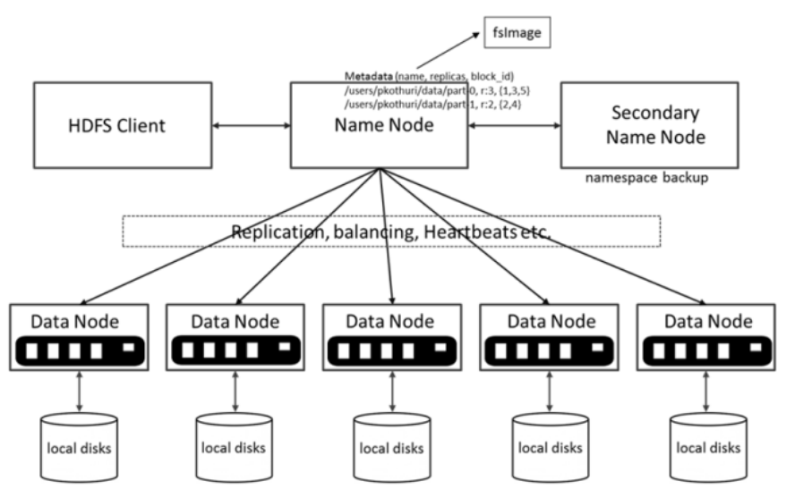
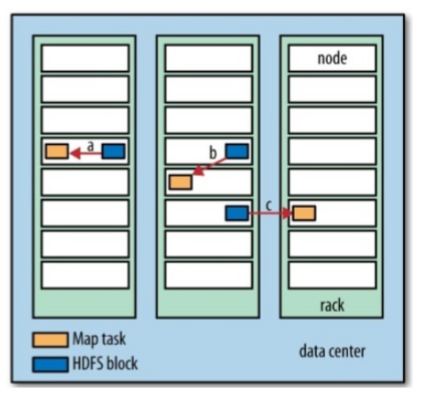

https://dzone.com/articles/an-introduction-to-hdfs

> HDFS는 NN(name node), DN(data node), Secondary NameNode로 구성된다.

[빅데이터 - 하둡, 하이브로 시작하기](https://wikidocs.net/book/2203)  
맵의 입력은 스플릿(InputSplit)단위로 분할된다.
적절한 스플릿 크기는 데이터 지역성의 이점을 얻을 수 있는 HDFS 블록의 기본 크기(128MB)이다.

