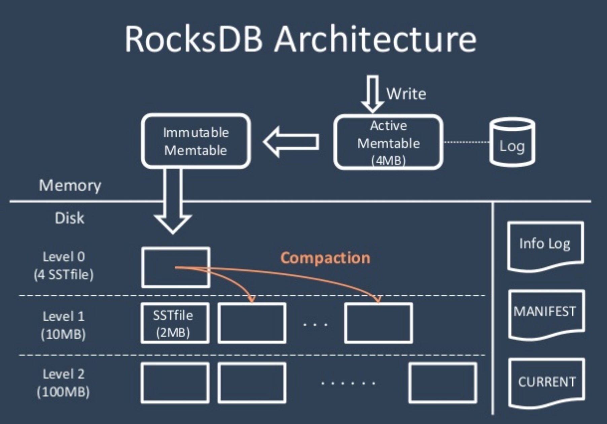

# RocksDB

## RocksDB 특징
- NoSQL
  - relational data model(table로 표현할 수 있음)이 아님
  - SQL 쿼리를 지원하지 않음
  - schemaless
- key-value storage
  - value는 unique key에 의해 접근 가능
- flash, RAM의 빠른 읽기/쓰기 성능을 활용할 수 있음
  - LSM-Tree(Log-Structured Merge-Tree) 구조 사용 (Hbase, Cassandra와 compaction 방법이 다름)
  - 디스크에서 여러 레벨의 트리구조로 데이터를 저장
  
 - https://meeeejin.gitbooks.io/rocksdb-wiki-kr/leveled-compaction.html
 - https://www.slideshare.net/meeeejin/rocksdb-detail
- 기본 operation
  - point lookup
    - key를 이용해서 value를 얻어오는것 get() multiget()
  - range scan
    - iterator를 이용해서 key 범위의 value 값을 얻을 수 있음
    ```
    for (it->Seek("hello"); it->Valid(); it->Next()) {
      // Do something with it->key() and it->value().
    }
    ```
  - WriteBatch
    - 여러개의 atomic update를 batch 형태로 한번에 할 수 있음
  ```
  write_batch.Put("key1", "value1")
  write_batch.Delete("key2")
  db->Write(write_batch)
  ```

- ColumnFamily
  - 여러개의 ColumnFamily를 만들 수 있음
  - 활용
    - 1. 데이터 타입별로 세팅을 달리 할때
    - 2. ColumnFamily별로 데이터 삭제 가능
    - 3. 메타 데이터, 실제 데이터 따로 다룰 수 있음  
  ({cf1, key1, value1}, {cf2, key2, value2})


## RocksDB 활용
  - kafka로 데이터를 보내기 전에 데이터를 저장해서 안정성을 높일 수 있다.
  - Queue로 활용하기
    - key에 대해 sorting을 자체적으로 해주기 때문에 sequencial key를 이용하면 queue로 사용가능하다.
    - key를 만들 때, queue_id + sequence_id 조합으로 만들어서 여러개의 큐를 구현할 수 있다.
    - 여러개의 thread가 동시에 접근할 때 sync 하게 처리 할 수 있어야 된다.
    - Column Family를 두개로 나눠서 하나는 현재 인덱스 보관용, 하나는 데이터 큐로 사용한다. (서버 다운시 시작 지점 저장)


## 참고 자료
- relational data model에서는 indexing를 위해 B+Tree를 사용 : https://www.youtube.com/watch?v=aZjYr87r1b8
