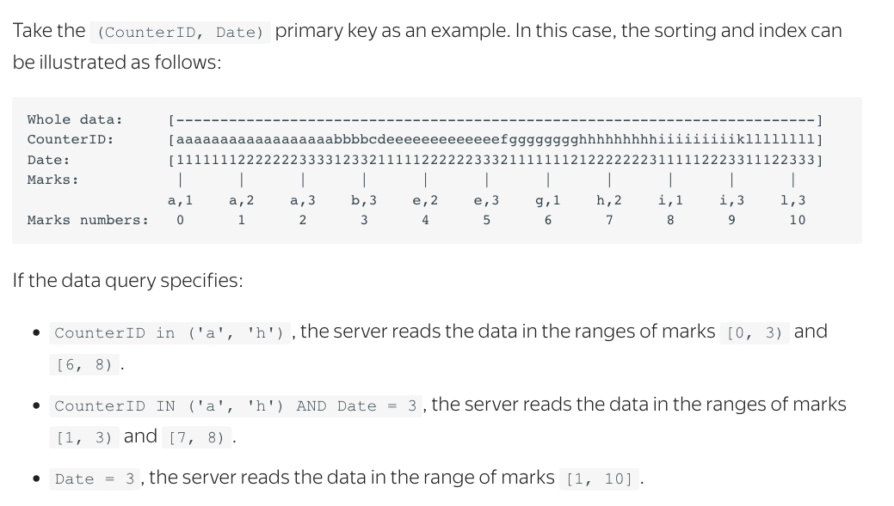

# ClickHouse


## Druid, Pinot과 차이점
- architecture: druid, pinot이 유사, clickhouse와 다름
    - Deep Storage(HDFS)가 필요없음
        - clickhouse 클러스터 안의 node에 데이터를 저장
    - Master node가 없음, 모든 node가 meta 데이터를 가지고 있음
    - lambda architecture가 필요없음
        - clickhouse는 batch data를 바로 넣을 수 있음
        - 15분 지연뒤에 기존 데이터와 새로운 데이터를 합침
> 간단한 구조라서 커스텀이 쉬울듯?
- Primary key sorting을 지원, inverted index(druid)는 지원하지 않음
- developer API(druid)를 제공하지 않음
- ~~pinot이 druid, clickhouse보다 최근 개발 속도가 빠르다 => 단점이자 장점?~~
    - clickhouse github 이슈가 제일 많음
- approximate query processing


## MergeTree
ClickHouse의 Engine은 데이터의 물리구조와 질의성능을 정함<br>
일반적으로 MergeTree를 사용


MergeTree Parameters
- date column
- (option) sampling expression
- primary key tuple
- index (Primary Key) granularity

[Example]

```
ENGINE = MergeTree(Date, (UserID, Query, MappingKey, Timstamp), 8192)
```

MergeTree Features
- sorting by primary key
- partitioning of rows
- replication
- sampling data

- primary key기준으로 mark
    - primary key로 선정한 필드를 기준으로 group by, unique count를 할때 빠름



```
SELECT COUNT(DISTINCT UserID)
FROM click;

one primary key : 1.790 sec
multikey : 0.876 sec
```

```
SELECT UserID, COUNT(*)
FROM click
GROUP BY UserID;

multikey 0.821 sec
```


## Partition
- row 단위의 partitioning을 제공

```
SELECT
    partition,
    name,
    active
FROM system.parts
WHERE table = 'click'
```

| partition | name | active |
| :-------- | :------- | :------ |
|  201910    |  20191020_20191020_1_6_1   |   1 |
|  201910    |  20191020_20191020_7_7_0   |   1 |
|  201910    |  20191020_20191020_8_8_0   |   1 |
|  201910    |  20191020_20191020_9_9_0   |   1 |
|  201910    |  20191020_20191020_10_10_0 |   1 |


## ClickHouse 실습
### 1. Creating Databases And Tables
- database - table 구조
- 일반적인 RDB의 create문과 유사

[format]
```
CREATE DATABASE database_name;

CREATE TABLE [IF NOT EXISTS] [db.]table_name [ON CLUSTER cluster]
(
    name1 [type1] [DEFAULT|MATERIALIZED|ALIAS expr1] [TTL expr1],
    name2 [type2] [DEFAULT|MATERIALIZED|ALIAS expr2] [TTL expr2],
    ...
    INDEX index_name1 expr1 TYPE type1(...) GRANULARITY value1,
    INDEX index_name2 expr2 TYPE type2(...) GRANULARITY value2
) ENGINE = MergeTree()
[PARTITION BY expr]
[ORDER BY expr]
[PRIMARY KEY expr]
[SAMPLE BY expr]
[TTL expr]
[SETTINGS name=value, ...];
```


[example]
```
CARETE DATABASE test;

USE test;

CREATE TABLE click
(
    ID String,
    Date Date,
    Timestamp DateTime,
    MappingKey String,
    UserID String,
    Tab Nullable(String),
    DocID Nullable(String),
    Query String,
    Day Nullable(UInt64),
    Hour Nullable(UInt64),
    Order Nullable(UInt64)
) ENGINE = MergeTree(Date, (UserID, Query, MappingKey, Timstamp), 8192);
```

> sorting by primary key => primary key로 정해진 필드를 기준으로 group by를 할때 유용<br>
-> primary key를 유저id로 정하면 UV를 구하는 속도가 빨라짐 <br>


### 2. Inserting Data

- merging insert data after 15 minutes
    - 지연없이 데이터를 넣음, lambda architecture가 필요없음
- perform non-scheduled merge using the optimize query

[Non-scheduled Merge]
```
OPTIMIZE TABLE click PARTITION 201910;
```

[Insert Parquet]
```
cat {filename} | clickhouse-client --query="INSERT INTO {some_table} FORMAT Parquet"
```

> 같은 row를 가지더라고 parquet은 하나의 파일로 안들어가고 json은 하나의 파일로 들어감<br>
parquet은 repartition해서 여러개의 파일로 만든뒤에 for loop로 넣음<br>
Parquet : 1.2G , JSONEachRow : 2.9G

### 3. Inserting, Updating, And Deleing Data And Columns

- column-oriented database이기 때문에 컬럼을 스키마에 추가, 삭제하는 것이 쉬움
- bulk update, delete를 지원
- 로우 단위로 update, delete할 수 없음
- 필터링 조건을 주고 업데이트/삭제 하는 것이 가능함

[Alter Table]
```
ALTER TABLE table_name ADD COLUMN column_name column_type;
ALTER TABLE visits DROP COLUMN location;
```

[Update table]
```
ALTER TABLE visits UPDATE url = 'http://example2.com' WHERE duration < 15;
```

> 필드추가, 데이터 업데이트를 손쉽게 할 수 있음<br>
서비스 초기에 데이터구조 변화가 빈번할 때 장점<br>
예를 들어 서비스 디바이스가 추가될때, 기존의 value를 바꿔야될 수도 있음<br><br>
service -> serviceapp, servicenavi


## 참고자료
- Clickhouse, Druid, Pinot 비교 : https://medium.com/@leventov/comparison-of-the-open-source-olap-systems-for-big-data-clickhouse-druid-and-pinot-8e042a5ed1c7
- CentOS에 ClickHouse 설치하기 : https://www.digitalocean.com/community/tutorials/how-to-install-and-use-clickhouse-on-centos-7
- ClickHouse tutorial : https://clickhouse.yandex/tutorial.html
- ClickHouse Input/Output Data Formats : https://clickhouse.yandex/docs/en/interfaces/formats/
- ClickHouse Partition : https://clickhouse.yandex/docs/en/operations/table_engines/custom_partitioning_key/
- ClickHouse Cluster : https://clickhouse.yandex/blog/en/evolution-of-data-structures-in-yandex-metrica
