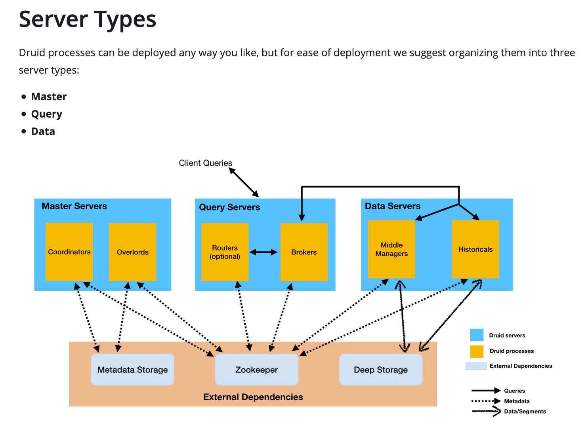
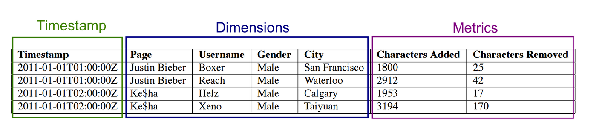

# Processes
- Coordinator : manage data availability
- Overload : assignment of data ingestion workloads
- Broker : 사용자 쿼리 처리
- Router : optional processes that can route requests to Brokers, Coordinators, and Overlords
- Historical process : store queryable data
- MiddleManager : responsible for ingesting data  

## Coordinator
- segment 관리와 분배(distribution)를 담당한다.
- Historical process와 커뮤니케이션 (?)
- 주기적으로 load new segment, drop outdated segment, manage segment replication, balance segment load
- Zookeeper에서 클러스터의 현재 상태를 확인

# Server  
- Master : Coordinator, Overload 담당, data availability 와 ingestion을 담당  
- Query : Broker, Router 담당, 외부 사용자 쿼리 처리
- Data : Historical, MiddleManager 담당, ingestion workload를 실행하고 queryable data를 저장한다.

# external dependency
- Metadata Storage : available segment and rule 저장
  - available segment : 
  - rule

    1 Master server (m5.2xlarge)
    2 Data servers (i3.4xlarge)
    1 Query server (m5.2xlarge)

# Segment
- Druid 데이터 저장단위
- timestamp를 기준으로 나눠진다.
- segment file size는 300MB-700MB 사이를 권장한다.
- file size가 범위를 넘어설 경우

https://druid.apache.org/docs/latest/design/segments.html
